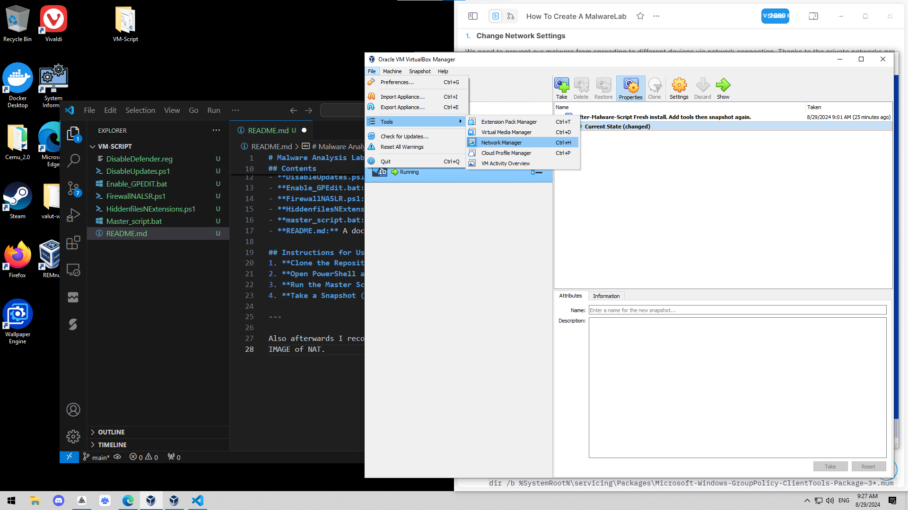
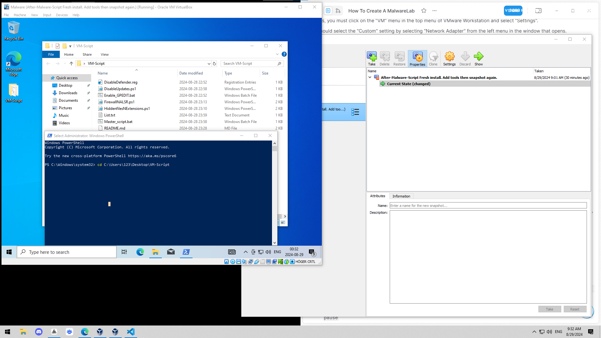
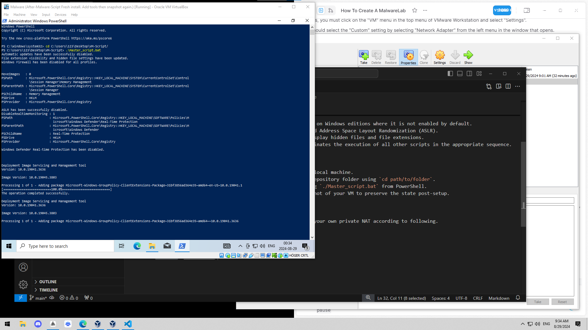

# Malware Analysis Lab Setup Scripts

## Overview
This repository contains scripts and configurations designed to configure a Windows environment specifically for malware analysis, without any tools. These scripts deactivate several critical Windows security features. This setup is particularly useful for testing modern malware builders or opening malicious files. Tools can be installed post-setup depending on the task requirements. Note: Installing Flare-VM can be time-consuming, and I've often had to factory reset my PC after accidentally opening malicious files on my host PC. This setup aims for convenience.

### Prerequisites:
- VirtualBox
- Windows 10 ISO

## Contents
- **DisableDefender.reg:** Disables Windows Defender.
- **DisableUpdates.ps1:** Stops Windows automatic updates.
- **Enable_GPEdit.bat:** Activates the Group Policy Editor on Windows editions where it is not enabled by default.
- **FirewallNASLR.ps1:** Turns off the Windows Firewall and Address Space Layout Randomization (ASLR) And turns off Automatic Updates.
- **HiddenfilesNExtensions.ps1:** Configures Windows to display hidden files and file extensions.
- **master_script.bat:** A comprehensive script that coordinates the execution of all other scripts in the appropriate sequence.
- **README.md:** A documentation file for the repository.

## Instructions for Use
1. **Create a Seperate Host-Only network for your VM in virtual box**: if you don't know how, theres some images below on how to.(Images below show how to create a NAT network which was incorrect, it's the same process but you should instead create a host-only network and assign that adapter to the VM)
2. **Clone the Repository:** Clone the repository to your local machine.
3. **Open PowerShell as Administrator:** Navigate to the repository folder using `cd path/to/folder`.
4. **Run the Master Script:** Execute the script by running `./Master_script.bat` from PowerShell.
5. **Press any key to continue:** IMPORTANT PRESS THE ENTER KEY, PRESSING ANY OTHER KEY WILL MESS UP THE SCRIPT.
6. **Take a Snapshot (Optional):** Consider taking a snapshot of your VM to preserve the state post-setup.

---

Also afterwards I recommend hardening your vm by creating your own private NAT according to following.
IMAGE of NAT.

Now your unprotected in the in the space of the world wide web, access vx-underground.org and try out some malware samples.

